# Architecture Diagrams

## System Overview

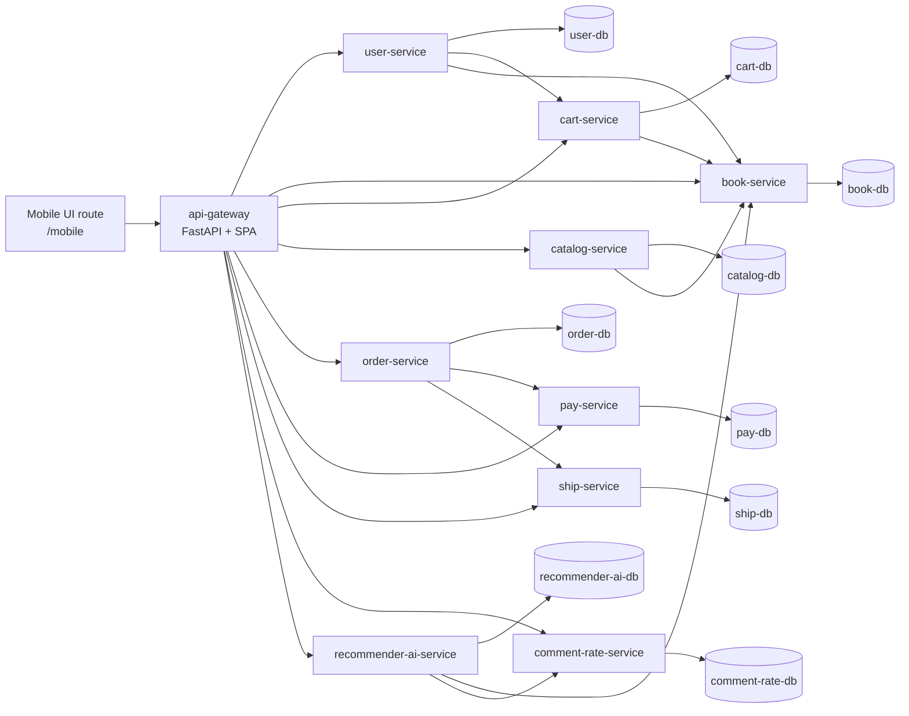

## 1. api-gateway

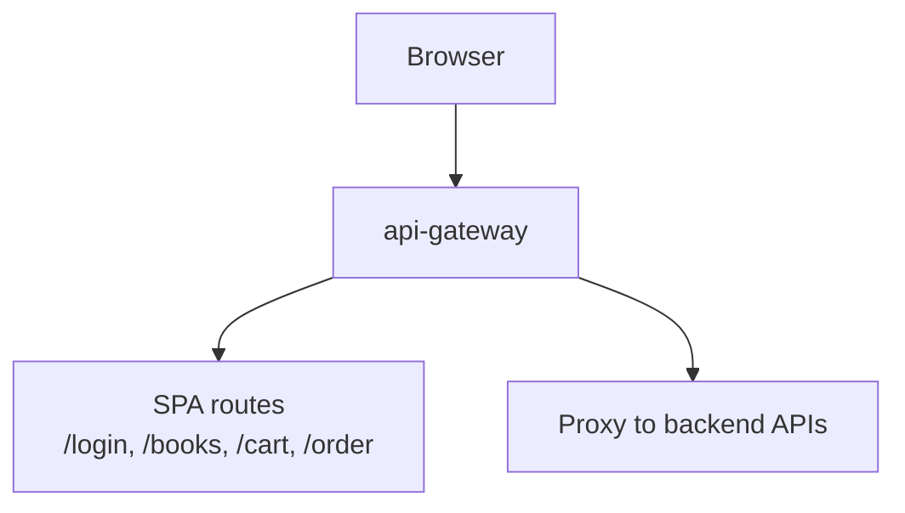

## 2. mobile-route

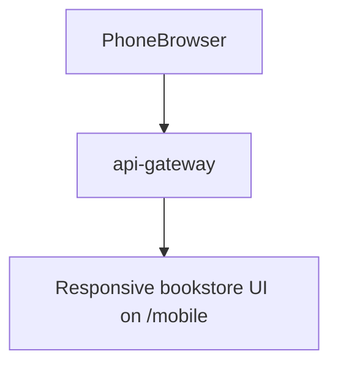

## 3. user-service

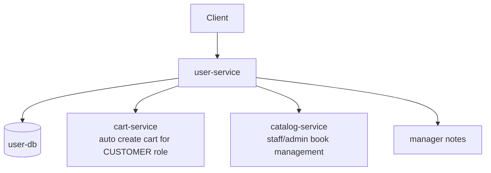

## 4. cart-service

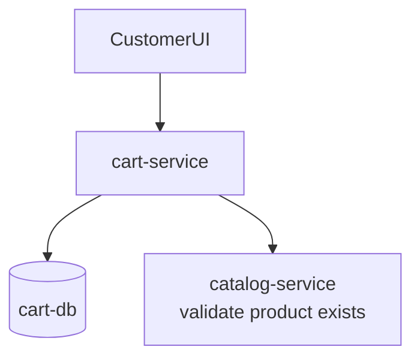

## 5. catalog-service

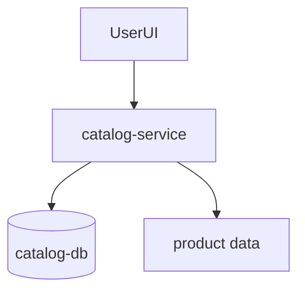

## 9. order-service

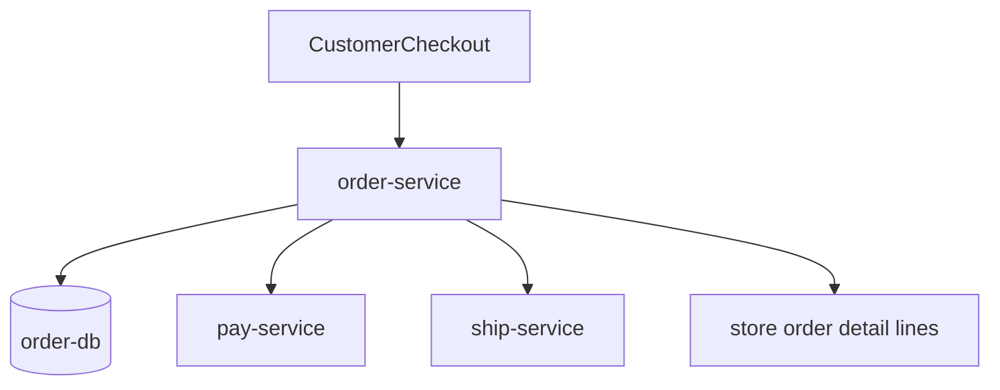

## 10. pay-service

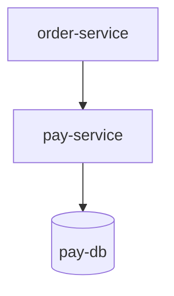

## 11. ship-service

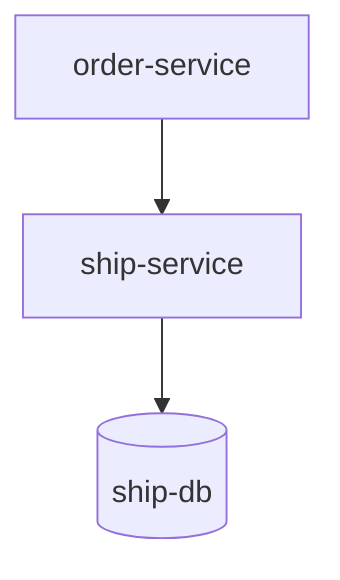

## 12. comment-rate-service

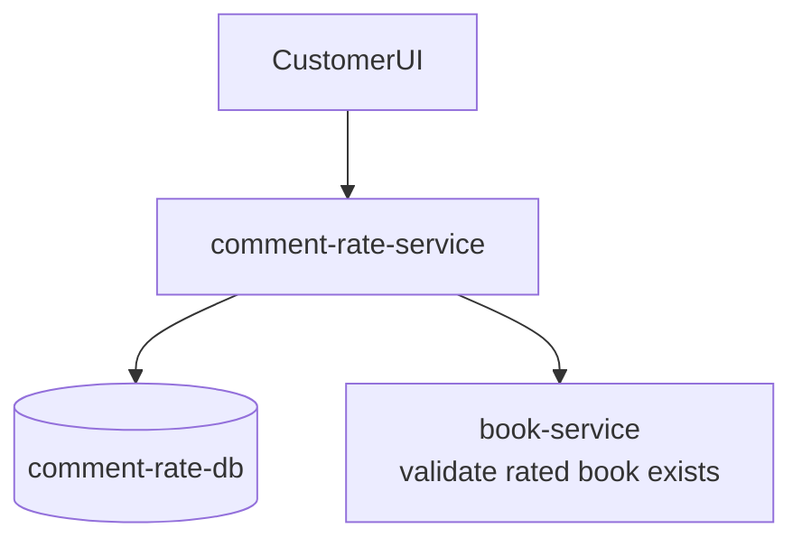

## 13. recommender-ai-service

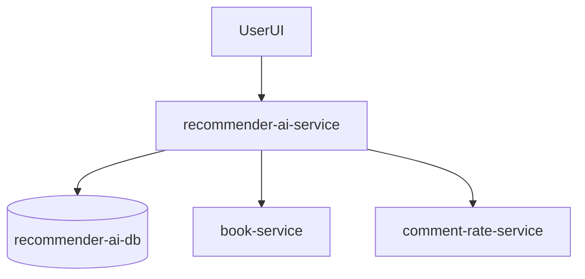

## Core Functional Sequences

### Customer Registration Creates Cart

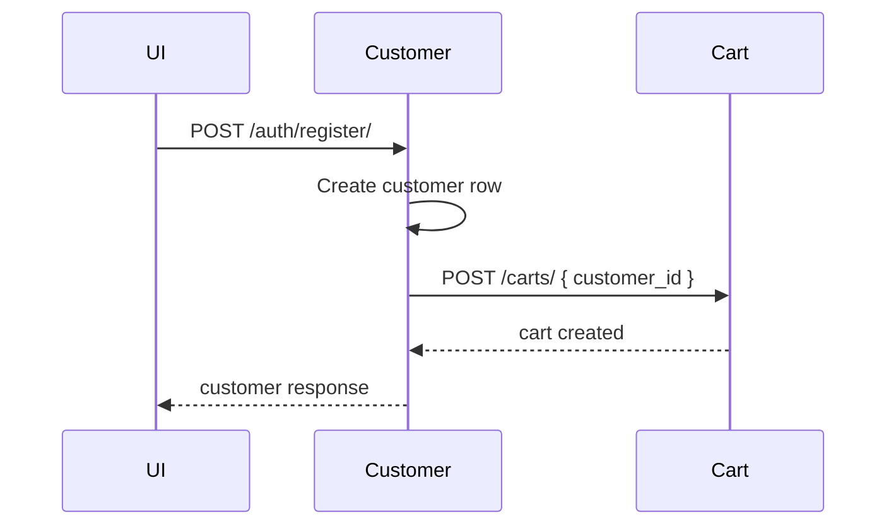

### Checkout Creates Order, Payment, Shipping

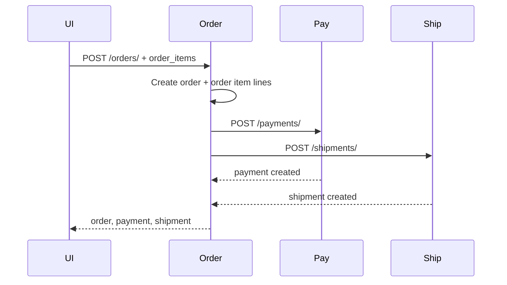

### PlantUML: Customer Chọn Sách -> Thêm Giỏ -> Thanh Toán

```plantuml
@startuml
title Customer đặt đơn hàng (Order Checkout)

actor Customer as C
participant "Web UI" as UI
participant "api-gateway\n(FastAPI)" as GW
participant "order-service" as ORD
database "order-db" as ORDDB
participant "pay-service" as PAY
database "pay-db" as PAYDB
participant "ship-service" as SHIP
database "ship-db" as SHIPDB

C -> UI: Chọn checkout
UI -> GW: POST /order/orders/\n{customer_id,total_amount,pay_method,ship_method,order_items}
GW -> ORD: Forward POST /orders/

ORD -> ORD: Validate pay_method, ship_method

alt Dữ liệu không hợp lệ
  ORD --> GW: 400 Bad Request
  GW --> UI: 400 + validation errors
  UI --> C: Hiển thị lỗi
else Hợp lệ
  ORD -> ORDDB: INSERT Order(status=CREATED)
  ORDDB --> ORD: order_id
  loop Với mỗi phần tử trong order_items
    ORD -> ORDDB: INSERT OrderItem(...)
  end

  ORD -> PAY: POST /payments/\n{order_id, method, amount}
  PAY -> PAYDB: INSERT Payment(status=PAID)
  PAYDB --> PAY: payment_id
  PAY --> ORD: 201 payment

  ORD -> SHIP: POST /shipments/\n{order_id, method}
  SHIP -> SHIPDB: INSERT Shipment(status=CREATED)
  SHIPDB --> SHIP: shipment_id
  SHIP --> ORD: 201 shipment

  alt Pay và Ship đều thành công (200/201)
    ORD -> ORDDB: UPDATE Order.status=PAYMENT_AND_SHIPPING_CREATED
    ORD --> GW: 201 {order,payment,shipment}
  else Một trong hai thất bại
    ORD -> ORDDB: UPDATE Order.status=PARTIAL_FAILED
    ORD --> GW: 201 {order,payment?,shipment?}
  end

  GW --> UI: Response checkout
  UI --> C: Hiển thị kết quả đơn hàng
end

opt Pay/Ship service unavailable (timeout/network)
  ORD -> ORDDB: UPDATE Order.status=DEPENDENCY_UNAVAILABLE
  ORD --> GW: 502 {error, order}
  GW --> UI: 502 Bad Gateway
  UI --> C: Báo lỗi phụ thuộc dịch vụ
end

@enduml