# Architecture Diagrams

## System Overview

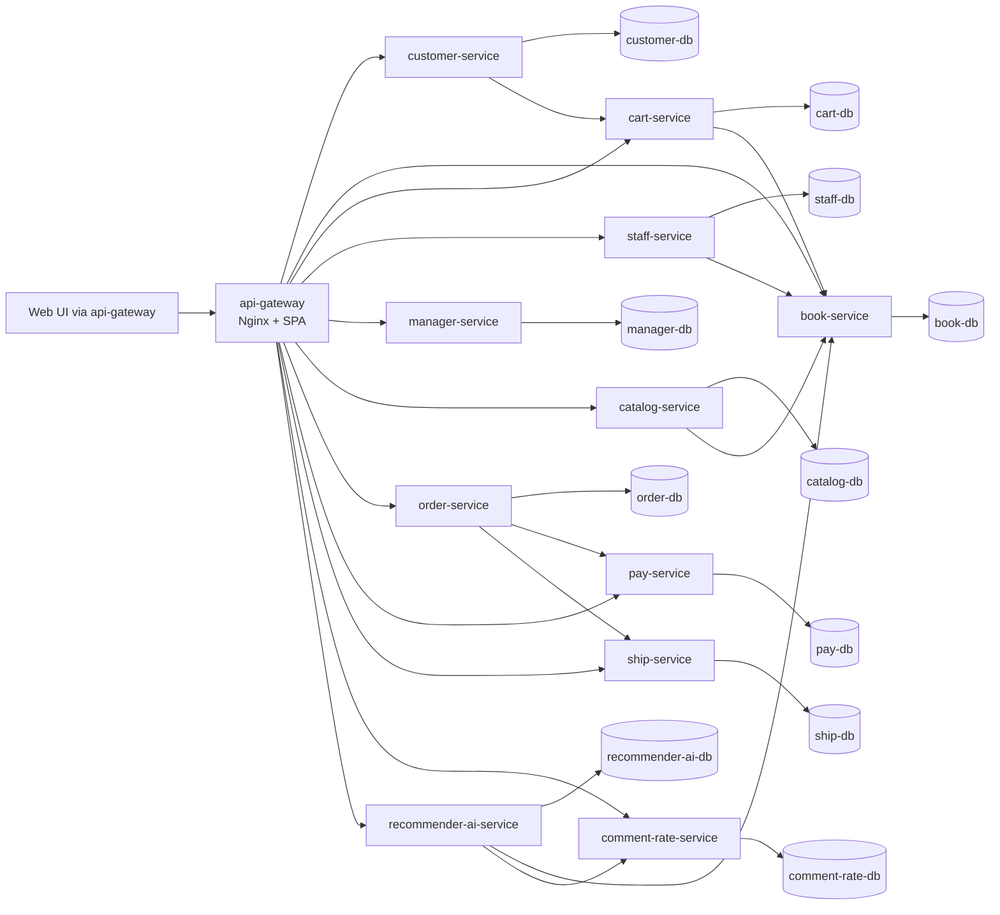

## 1. api-gateway

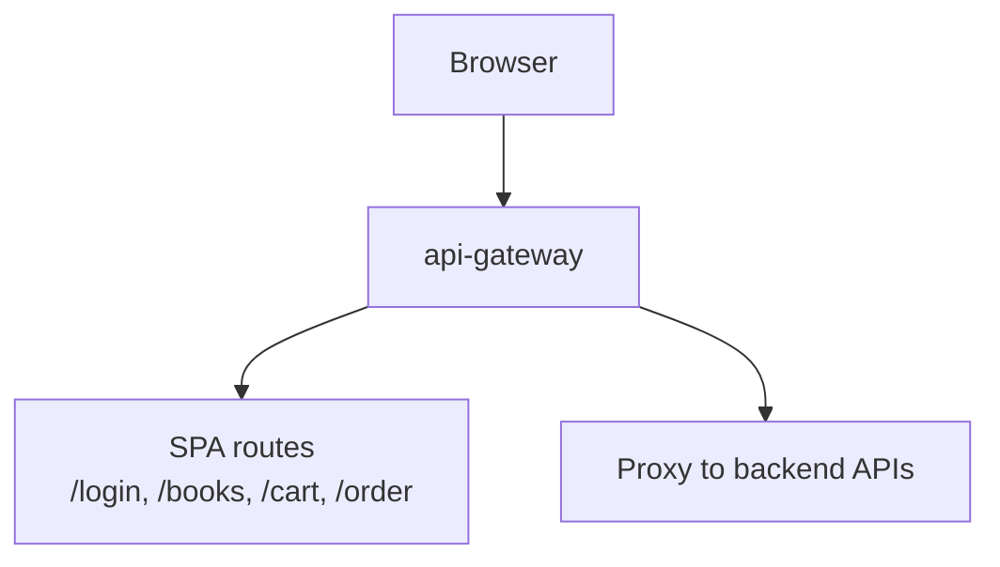

## 2. customer-service

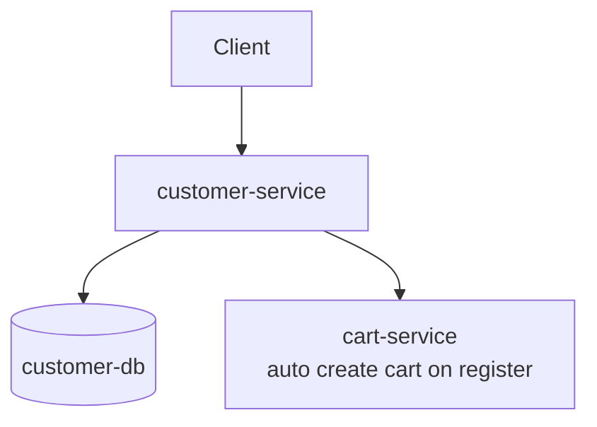

## 3. book-service

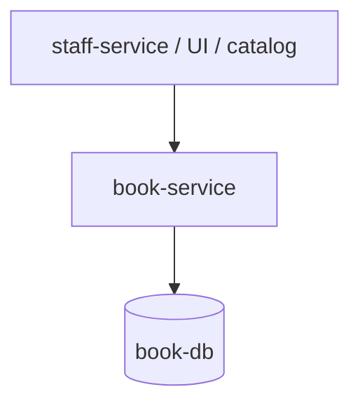

## 4. cart-service

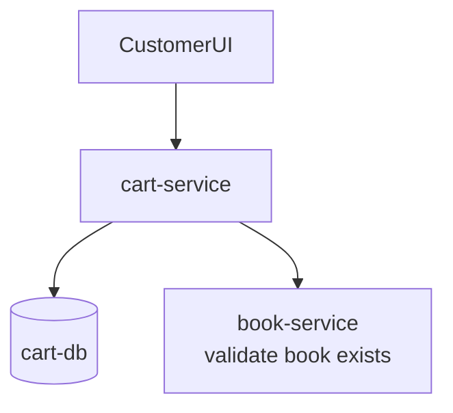

## 5. staff-service

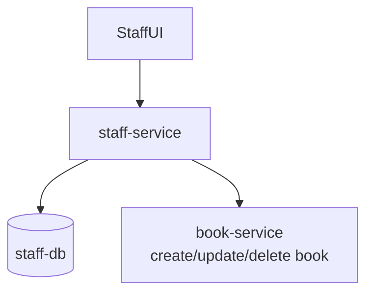

## 6. manager-service

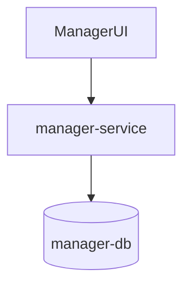

## 7. catalog-service

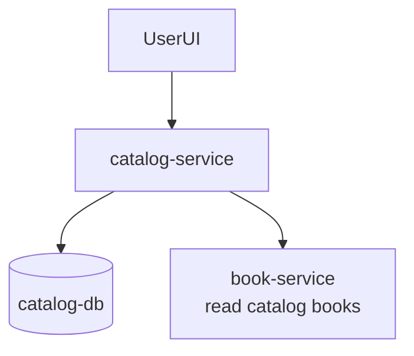

## 8. order-service

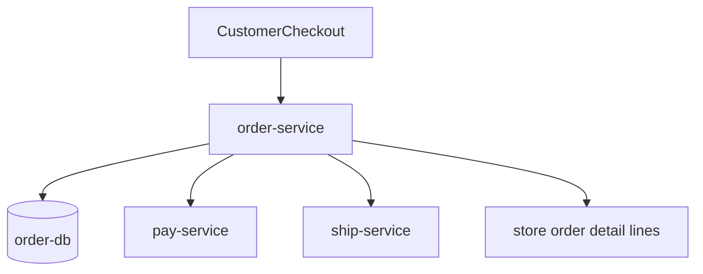

## 9. pay-service

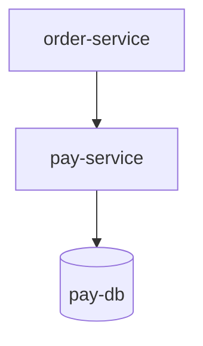

## 10. ship-service

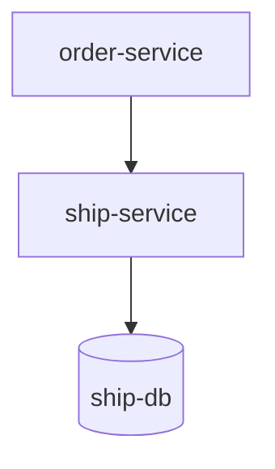

## 11. comment-rate-service

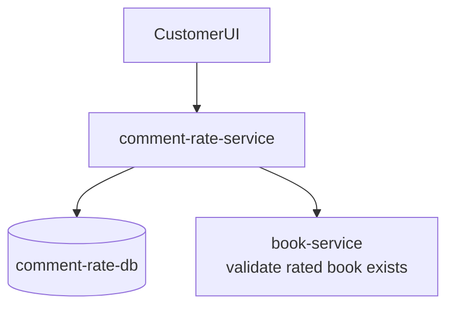

## 12. recommender-ai-service

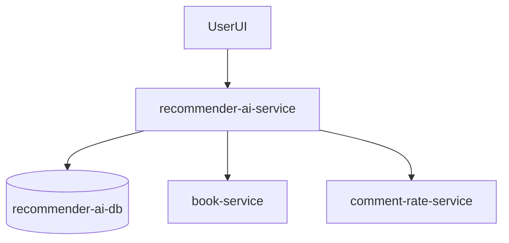

## Core Functional Sequences

### Customer Registration Creates Cart

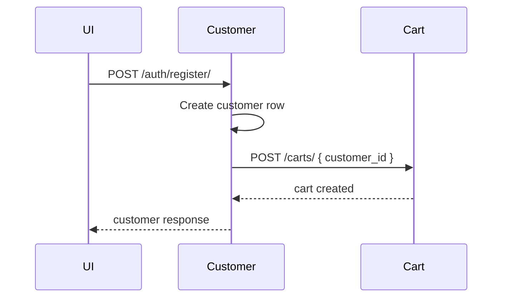

### Checkout Creates Order, Payment, Shipping

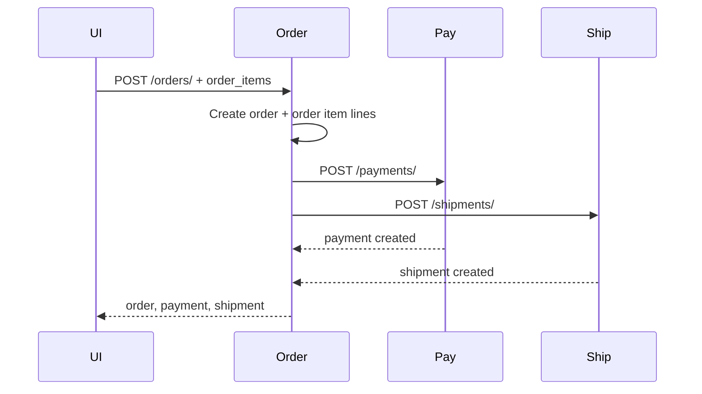
